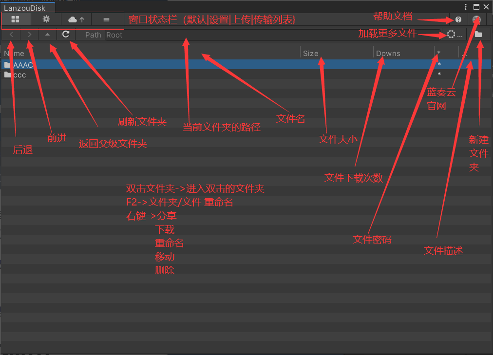
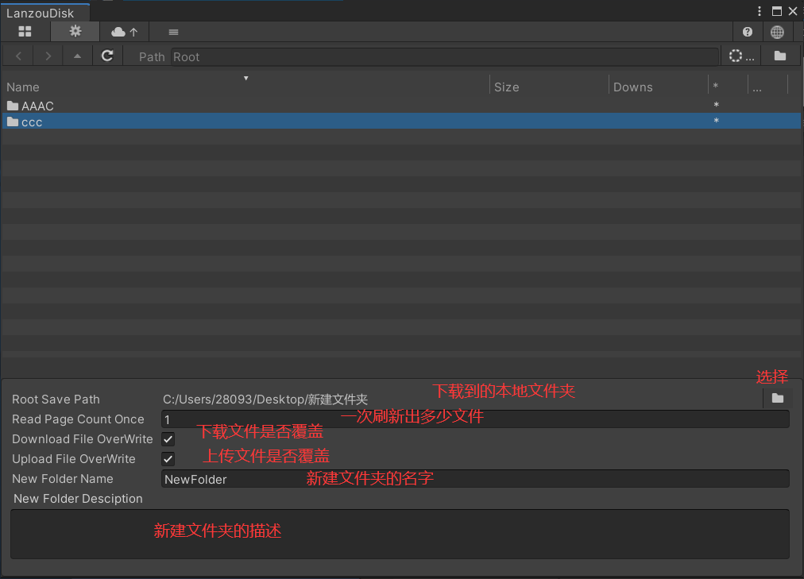
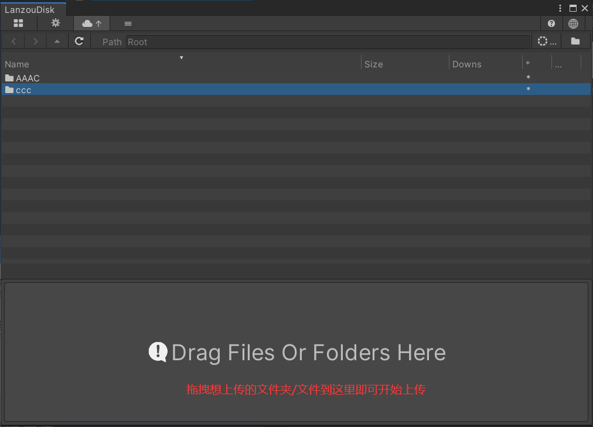

<h1 align="center">- 蓝奏云Unity编辑器 Disk -</h1>

# 简介

- 本库封装了蓝奏网盘的基础功能: 登录、注销、获取文件(夹)列表、下载文件、上传文件、删除文件(夹)、
移动文件、清空回收站、恢复文件(夹)、创建文件夹、设置文件(夹)访问密码、设置文件(夹)描述

- 解决了蓝奏云的上传格式限制和单文件大小限制，同时增加了以下功能: 批量上传/下载文件、
上传/下载时断点续传、清理"幽灵"文件夹、移动文件夹、获取下载直链

- 如果有任何问题或建议, 欢迎提 issue, 维护不易，求一个 star (\*/ω＼*)

# 如何使用
* 1、在[蓝奏云官网](https://up.woozooo.com/) 注册一个帐号
* 2、在 Project 窗口 右键 选择 Create/Lanzou Cookie
* 3、获取 Lanzou Cookie 配置 ylogin（7位数字） phpdisk_info（很长一串） [帮助1](https://blog.csdn.net/u011781521/article/details/87791125) [帮助2](https://bbs.zsxwz.com/thread-2505.html)
* 4、选择 创建 的 Lanzou Cookie 填写 好配置
* 5、双击 配置好的 Lanzou Cookie 即可打开窗口 使用

# 免责声明

- 本项目仅供个人学习使用，严禁用于商业用途
- **本项目没有任何担保**，如果您使用这些代码，您必需承担其带来的风险
